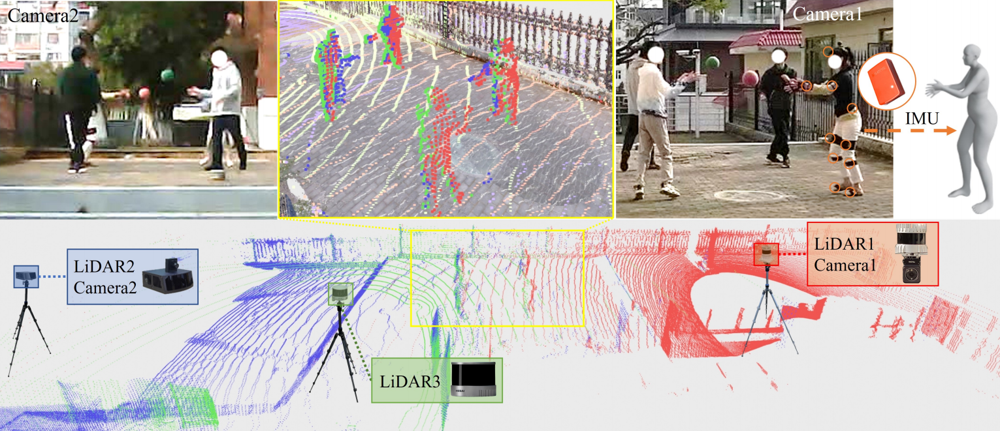

# ViLi: Occlusion-aware 3D Human Mocap Dataset in Multi-person Large-scale Scenes



*ViLi is a human mocap dataset in multi-person large-scale scenes. The pictures showcase the multi-person interaction in the large-scale scene with capture distances of up to 30 meters andplacement of the multi-view LiDARs, RGB cameras, and IMUs.*

# Download and Structure
**[Dataset webpage](http://www.lidarhumanmotion.net/vili)**

**[Dataset download link(password:Mu75r.iL-he!Lde)](http://www.cwang93.net:1000/share/ZVL5Z5gP)**

After unzip the vili_dataset.zip, the folder structure should be like this: 
```
${ROOT}
|-- scene
|   |-- scanned_scene_part1.las
|   |-- scanned_scene_part2.las
|   |-- scanned_scene_part3.las
|   |-- scanned_scene_downsampled_1cm.ply
|-- sequences
|   |-- sequence001.hdf5
|   |-- sequence002.hdf5
|   |-- sequence003.hdf5
|   |-- ...
|   |-- sequence046.hdf5
|-- shape
|   |-- pid001.json
|   |-- pid002.json
|   |-- pid003.json
|   |-- ...
|   |-- pid013.json
```

**Structure of sequence file** 
Each .hdf5 file represents a sequence and contains multiple keys with their corresponding values. Note that the data related to the camera are currently being processed and will be available soon. For example, the structure of sequence001.hdf5, is as follows:
```
sequence001.hdf5
|-- camera1_K (3, 3): The intrinsic matrix for Camera 1.
|-- camera1_R (3, 3): The rotation of the extrinsic matrix for Camera 1.
|-- camera1_t (3,): The translation vector of the extrinsic matrix for Camera 1.
|-- camera1_dist (5,): Distortion coefficients for Camera 1.
|-- camera1_raw_frame_index (15465,): Indexes of raw frames of mp4 video file from Camera 1.
|-- camera1_ts (15465,): Synchronized timestamps for each frame from Camera 1.
|-- camera2_K (3, 3): 
|-- ...
|-- imu_raw_frame_index (30960,): Indexes of raw frames from the IMU.
|-- imu_smpl_pose (30960, 72): SMPL human poses of person with IMU.
|-- imu_smpl_trans (30960, 3): Global trajectory of person with IMU.
|-- imu_ts (30960,): Synchronized timestamps for each frame from the IMU.
|-- person_name_list: (4, ) the ID of persons in the scene.
|-- lidar1_pid003_RT (4, 4): Calibration matrix from the first LiDAR for person with ID pid003.
|-- lidar1_pid003_pc (2757390, 3): Human point cloud data from the first LiDAR for person with ID pid003.
|-- lidar1_pid003_pc_len (10079,): Length of each frame's human point cloud from the first LiDAR for person with ID pid003.
|-- lidar1_pid003_raw_frame_index (10079,): Indexes of each human point cloud frame in the raw data from the first LiDAR for person with ID pid003.
|-- lidar1_pid003_ts (10079,): Synchronized timestamps for each human point cloud frame from the first LiDAR for person with ID pid003.
|-- lidar2_pid003_RT (4, 4): 
|-- ...
|-- lidar3_pid003_RT (4, 4): 
|-- ...
|-- lidar1_pid006_RT (4, 4): Calibration matrix from the first LiDAR for person with ID pid006.
|-- ...
```

# Visualization
To assist you in viewing the dataset, we've provided a Python script named visualize.py. You can use this script to visualize individual .h5 files and better understand the structure and content of the data.

Usage:
```
cd ${root}/ovis
python o3d_server.py    # open the open3d visualizer
```
```
cd ${root}
python visualization/main.py --file <path_to_hdf5_file>
```

# License
Our dataset is licensed under custom(noncommercial), please refer to http://www.lidarhumanmotion.net/license/. By downloading and using this dataset, you agree to the terms and conditions of this license. Please ensure that you read and understand the license before using the dataset.This dataset is intended for academic and non-commercial use only.